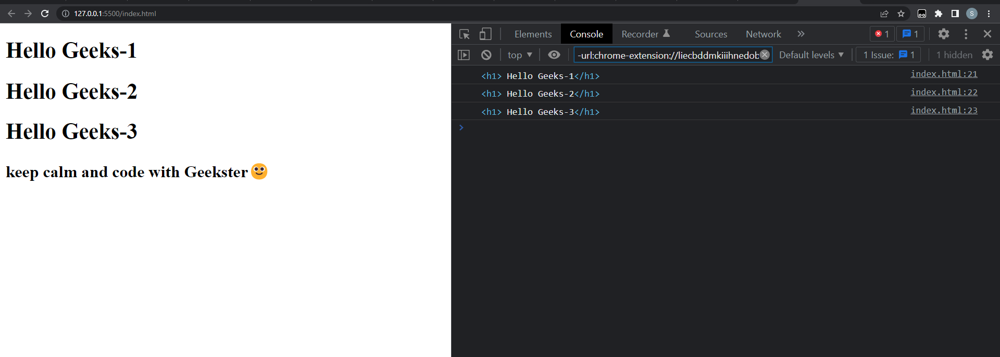
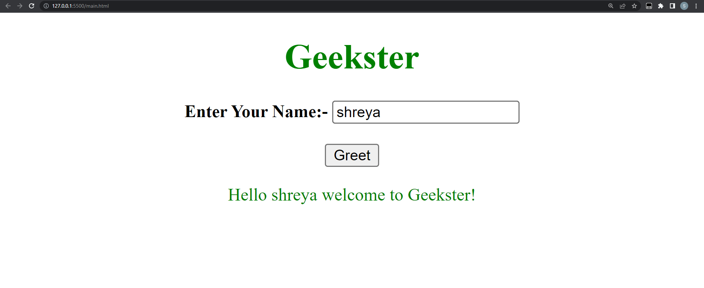
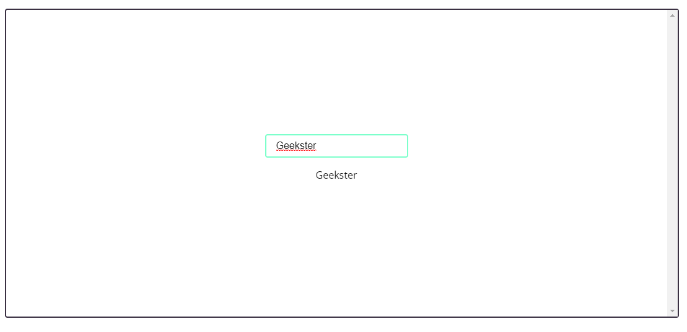
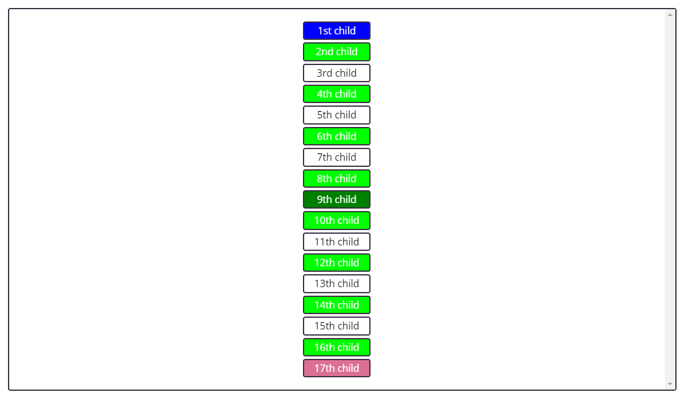

# Learn DOCUMENT OBJECT MODEL(DOM) with Geekster

- [Day 1](#day-1)
	- [What is DOM](#What-is-DOM)
		- [Getting Element](#getting-element)
			- [Get HTML element by Id](#Get-HTML-element-by-Id)
			- [Get HTML element by className](#Get-HTML-element-by-className)
			- [Get HTML element by Name](#Get-HTML-element-by-Name)
			- [Get HTML element by tagName](#Get-HTML-element-by-tagName)
			- [Get HTML element by CSS Selector](#Get-HTML-element-by-CSS-Selector)
		- [Adding attribute](#adding-attribute)
			- [Adding attribute using setAttribute](#adding-attribute-using-setattribute)
			- [Adding attribute without setAttribute](#adding-attribute-without-setattribute)
			- [Adding and removing class using classList](#Adding-and-removing-class-using-classList)
		- [Adding Text to HTML element](#adding-text-to-html-element)
			- [Adding Text content using textContent](#adding-text-content-using-textcontent)
			- [Adding Text Content using innerHTML](#adding-text-content-using-innerhtml)
		- [Adding style](#adding-style)
			- [Adding Style Color](#adding-style-color)
			- [Adding Style Background Color](#adding-style-background-color)
			- [Adding Style Font Size](#adding-style-font-size)
	- [Exercises](#exercises)
	
  # Day 1

## What is DOM

DOM is a method of representing the website in a hierarchically structured form, making it simpler for programmers and users to navigate the document. Using the DOM, we may quickly access and modify HTML tags, IDs, classes, attributes, or elements using the Document object's given commands or methods. JavaScript can access the web page's HTML and CSS using the DOM and can also give HTML elements behavior. Therefore, Document Object Model is essentially an API that interacts with and represents HTML or XML documents.

#### Example

An HTML document is seen by the DOM as a tree of nodes. An HTML element is represented by a node.
To better grasp the DOM tree structure, let's look at this HTML code.

```html
<!DOCTYPE html>
<html lang="en">
  <head>
    <meta charset="UTF-8">
    <meta name="viewport" content="width=device-width, initial-scale=1.0">
    <meta http-equiv="X-UA-Compatible" content="ie=edge">
    <title>Learn DOM with Geekster</title>
  </head>
  <body>
    <h1>DOM tree structure</h1>
	<h2>Learn about the DOM</h2>
  </body>
</html>
```

The <html> element is the only child node in our document, which is referred to as the root node. The <head> and <body> elements are the two children of the <html> element.
The elements <head> and <body> both have their own children.
  
Here is another way to represent this node-based tree.

 
  

### Getting Element

Users can access HTML elements with JavaScript in five distinct ways from the DOM.

- Get HTML element by Id
  
- Get HTML element by className
  
- Get HTML element by Name
 
- Get HTML element by tagName
  
- Get HTML element by CSS Selector

<hr>
  
### **Get HTML element by Id**

The Document method getElementById() returns an Element object representing the element whose id property matches the specified string. Since element IDs are required to be unique if specified, they're a useful way to get access to a specific element quickly.

**SYNTAX**

  ```js
  getElementById(id)
```
  
**EXAMPLE**

```html
<!DOCTYPE html>
<html lang="en">
<head>
	<meta charset="UTF-8">
	<meta http-equiv="X-UA-Compatible" content="IE=edge">
	<meta name="viewport" content="width=device-width, initial-scale=1.0">
	<title>Learn DOM with Geekster</title>
</head>
<body>
	<h1 id="geekster"> Hello Geeks!</h1>
	<h2>keep calm and code with Geekster🙂</h2>

	<script>
		// Accessing the element by getElementById method
		var temp = document.getElementById("geekster");
		console.log(temp);
        console.log(temp.innerHTML);
	</script>
</body>
</html>
```
**OUTPUT**
 

 
<hr>
	
### **Get HTML element by className**

The getElementsByClassName method of Document interface returns an array-like object of all child elements which have all of the given class name(s).

When called on the document object, the complete document is searched, including the root node. You may also call getElementsByClassName() on any element; it will return only elements which are descendants of the specified root element with the given class name(s).  

**SYNTAX**
	
```js
getElementsByClassName(names)
```
**EXAMPLE**
```html
<!DOCTYPE html>
<html lang="en">
<head>
	<meta charset="UTF-8">
	<meta http-equiv="X-UA-Compatible" content="IE=edge">
	<meta name="viewport" content="width=device-width, initial-scale=1.0">
	<title>Learn DOM with Geekster</title>
</head>
<body>
	<h1 class="geekster"> Hello Geeks-1</h1>
	<h1 class="geekster"> Hello Geeks-2</h1>
	<h1 class="geekster"> Hello Geeks-3</h1>

	<h2>keep calm and code with Geekster🙂</h2>

	<script>
      
        // Accessing the element by getElementsByclassName method
        var temp = document.getElementsByClassName("geekster");
        console.log(temp[0]);
        console.log(temp[1]);
        console.log(temp[2]);
    </script>
</body>
</html
```

**OUTPUT**

	

<hr>

### **Get HTML element by Name**

The getElementsByName() method of the Document object returns a NodeList Collection of elements with a given name attribute in the document.
	
**SYNTAX**

```js
getElementsByName(name)
```

**EXAMPLE**

```html
<!DOCTYPE html>
<html lang="en">
<head>
	<meta charset="UTF-8">
	<meta http-equiv="X-UA-Compatible" content="IE=edge">
	<meta name="viewport" content="width=device-width, initial-scale=1.0">
	<title>Learn DOM with Geekster</title>
</head>
<body>
	<h1 name="geekster"> Hello Geeks-1</h1>
	<h1 name="geekster"> Hello Geeks-2</h1>
	<h1 name="geekster"> Hello Geeks-3</h1>

	<h2>keep calm and code with Geekster🙂</h2>

	<script>
      
        // Accessing the element by getElementsByName method
        var temp = document.getElementsByName("geekster");
        console.log(temp[0]);
        console.log(temp[1]);
        console.log(temp[2]);
    </script>
</body>
</html>	
```
**OUTPUT**


<hr>

### **Get HTML element by tagName**

The Element.getElementsByTagName() method returns a live HTMLCollection of elements with the given tag name.

All descendants of the specified element are searched, but not the element itself. The returned list is live, which means it updates itself with the DOM tree automatically. Therefore, there is no need to call Element.getElementsByTagName() with the same element and arguments repeatedly if the DOM changes in between calls.

**SYNTAX**

```js
getElementsByTagName(tagName)
```
**EXAMPLE**

```html
<!DOCTYPE html>
<html lang="en">
<head>
	<meta charset="UTF-8">
	<meta http-equiv="X-UA-Compatible" content="IE=edge">
	<meta name="viewport" content="width=device-width, initial-scale=1.0">
	<title>Learn DOM with Geekster</title>
</head>
<body>
	<h1> Hello Geeks-1</h1>
	<h1> Hello Geeks-2</h1>
	<h1> Hello Geeks-3</h1>

	<h2>keep calm and code with Geekster🙂</h2>

	<script>
      
        // Accessing the element by 
        // getElementsByTagName method
        var temp = document.getElementsByTagName("h1");
        console.log(temp[0]);
        console.log(temp[1]);
        console.log(temp[2]);
    </script>
</body>
</html>
```

**OUTPUT**



<hr>

### **Get HTML element by CSS Selector**
	
The Document method querySelector() returns the first Element within the document that matches the specified selector, or group of selectors. If no matches are found, null is returned.

**SYNTAX**

```js
querySelector(selectors)
```
	
**EXAMPLE**
	
```html
<!DOCTYPE html>
<html lang="en">
<head>
	<meta charset="UTF-8">
	<meta http-equiv="X-UA-Compatible" content="IE=edge">
	<meta name="viewport" content="width=device-width, initial-scale=1.0">
	<title>Learn DOM with Geekster</title>
</head>
<body>
	<h1 class="geekster" id="g1"> Hello Geeks-1</h1>
	<h1 class="geekster" id="g2"> Hello Geeks-2</h1>
	<h1 class="geekster" id="g3"> Hello Geeks-3</h1>

	<h2 class="geekster">keep calm and code with Geekster🙂</h2>

	<script>
      
      // Accessing the element by class name 
        // using querySelector
        var temp = document.querySelector(".geekster");
        console.log(temp);
  
        // Accessing the element by id using querySelector
        temp = document.querySelector("#g2");
        console.log(temp);
  
        // Accessing the element by class name and
        // id using querySelector
        temp = document.querySelector(".geekster#g2");
        console.log(temp);
  
        // Accessing the element by tag name that
        // includes the particular class
        temp = document.querySelector("h2.geekster");
        console.log(temp);
    </script>
</body>
</html>
```

**OUTPUT**


<hr>
	
# Adding attribute
	

In HTML, tags may have attributes. When the browser parses the HTML to create DOM objects for tags, it recognizes standard attributes and creates DOM properties from them.

## **Adding attribute using setAttribute**
	
**SYNTAX**
	
```js
var elementVar = document.getElementById("element_id");
elementVar.setAttribute("attribute", "value");
```

**EXAMPLE**
	
```html
<!DOCTYPE html>
<html lang="en">
<head>
    <meta charset="UTF-8">
    <meta http-equiv="X-UA-Compatible" content="IE=edge">
    <meta name="viewport" content="width=device-width, initial-scale=1.0">
    <title>Learn DOM with Geekster</title>
    <script>
        function modify() {
            //update style attribute of element "heading"
 
            var heading = document.getElementById("heading");
            heading.setAttribute("style", "color:green");
        }
    </script>
</head>
<body>
    <h1 style="color:black"
        id="heading"
        align="center">
      Geekster✈️
  </h1>
  <div align="center">

    <button onclick="modify()" > Change color </button>
  </div>

</body>
</html>
```
	
**OUTPUT**


<hr>

## **Adding attribute without setAttribute**
	
**SYNTAX**
	
```js
document.getElementById("element_id").attribute = attribute_value;
```
	
**EXAMPLE**
	
```html
<!DOCTYPE html>
<html lang="en">
<head>
    <meta charset="UTF-8">
    <meta http-equiv="X-UA-Compatible" content="IE=edge">
    <meta name="viewport" content="width=device-width, initial-scale=1.0">
    <title>Learn DOM with Geekster</title>
    <script>
        function Greet() {
            //get the values of name using getAttribute()
            var name =(document.getElementById("name").value);
            //output the result in green colour
            var output = "Hello "+ name+" welcome to Geekster!";
            document.getElementById("result").style = "color:green";
            document.getElementById("result").innerHTML = output;
        }
    </script>
</head>
<body>
    <h1 style="color:green" align="center">Geekster</h1>
    <p align="center">
        <b>Enter Your Name:- </b>
        <input type="text" id="name">
        <br>
        <br>
        <button onclick="Greet()">Greet</button>
        <b><p id="result" align="center"></p>
</b>
 
    </p>
</body>
</html>
```
	
**OUTPUT**



<hr>
	
## **Adding and removing class using classList**
	
It is read-only to use the classList attribute. This property makes use of the "classList.length" attribute, which returns the element's class names as a DOMTokenlist (set of space-separated tokens). To add, remove, and toggle CSS classes on an element, however, utilise this property.

NOTE: IE9 and earlier do not support the classList attribute.
	
**SYNTAX**

```js
 const elementClasses = elementNodeReference.classList;
```

**EXAMPLE**
	
```html
<!DOCTYPE html>
<html lang="en">
<head>
    <meta charset="UTF-8">
    <meta http-equiv="X-UA-Compatible" content="IE=edge">
    <meta name="viewport" content="width=device-width, initial-scale=1.0">
    <title>Learn DOM with Geekster</title>
    <style>
        .mystyle {
            align: center;
            border: 1px solid blue;
            height: 100px;
            padding-top: 35px;
            background: lightgreen;
            color: Black;
            font-size: 70px;
        }
    </style>
</head>
<body>
 <p>Click the buttons to see the add and remove of "mystyle" class to DIV.</p>
     <button onclick="myFunction()">Add class</button>
     <div id="myDIV"> Geekster ✈️✈️</div>
     
        <script>
            function myFunction() {
     
                document.getElementById("myDIV").classList.add("mystyle");
     
            }
            function Remove() {
                document.getElementById("myDIV").classList.remove("mystyle");
            }
        </script>
     
        <button onclick="Remove()">Remove class</button>
     
    </body>
</html>	
```
	
**OUTPUT**
	
Before adding a class 
	

	
After clicking on add class button 


	
After clicking on remove class button 
	

	
<hr>
	
# Adding Text to HTML element
	
An HTML is a build block of an opening tag, a closing tag and a text content. We can add a text content using the property textContent or *innerHTML.

## **Adding Text content using textContent**
The text content of the specified node and all of its descendants can be set or returned using the HTML textContent attribute. Although this property is quite similar to nodeValue, it returns the text of every child node.

**SYNTAX**
	
```js
node.textContent = text
```
**EXAMPLE**

```html
<!DOCTYPE html>
<html lang="en">
<head>
    <meta charset="UTF-8">
    <meta http-equiv="X-UA-Compatible" content="IE=edge">
    <meta name="viewport" content="width=device-width, initial-scale=1.0">
    <title>Learn DOM with Geekster</title>
</head>
<body>
    <h2 id="geek">Hello Geeks! Welcome to Geekster✈️</h2>
    <button onclick = "MyGeeks()"> click here to change the content</button> 
    <script>
        function MyGeeks() {
            document.getElementById("geek").textContent
            = "Unlock your true potential with Geekster";
        }
    </script>
</body>
</html>	
```
	
**OUTPUT**

Prior to pressing the button
	

	
After pressing the button
	

	
<hr>

## **Adding Text Content using innerHTML**
	
**SYNTAX**

```js
elem.innerHTML
```	
	
**EXAMPLE**

```html
<!DOCTYPE html>
<html lang="en">
<head>
    <meta charset="UTF-8">
    <meta http-equiv="X-UA-Compatible" content="IE=edge">
    <meta name="viewport" content="width=device-width, initial-scale=1.0">
    <title>Learn DOM with Geekster</title>
</head>
<body>
    <h2 id="geek">Hello Geeks! Welcome to Geekster✈️</h2>
    <button onclick = "MyGeeks()"> click here to change the content</button> 
    <script>
        function MyGeeks() {
            document.getElementById("geek").innerHTML
            = "Unlock your true potential with Geekster";
        }
    </script>
</body>
</html>
```
**OUTPUT**

Prior to pressing the button
	

	
After pressing the button
	


<hr>

# Adding Text to HTML element

The DOM style color property is used to set or return the color of the text. It is used to set the color property.

**SYNTAX**

```js
object.style.color
```

**EXAMPLE**
	
```html
<!DOCTYPE html>
<html lang="en">
<head>
    <meta charset="UTF-8">
    <meta http-equiv="X-UA-Compatible" content="IE=edge">
    <meta name="viewport" content="width=device-width, initial-scale=1.0">
    <title>Learn DOM with Geekster</title>
</head>
<body>
    <h2 id="geek">Hello Geeks! Welcome to Geekster✈️</h2>
    <button onclick = "MyGeeks()"> click here to change the color</button> 
    <script>
        function MyGeeks() {
            document.getElementById("geek").style.color="green";
        }
    </script>
</body>
</html>	
```
**OUTPUT**
	
before clicking button
	


After clicking button
	


<hr>
	
## **Adding Style Background Color**

**SYNTAX**

```js
object.style.backgroundColor
```

**EXAMPLE**
	
```html
<!DOCTYPE html>
<html lang="en">
<head>
    <meta charset="UTF-8">
    <meta http-equiv="X-UA-Compatible" content="IE=edge">
    <meta name="viewport" content="width=device-width, initial-scale=1.0">
    <title>Learn DOM with Geekster</title>
</head>
<body>
    <h2 id="geek">Hello Geeks! Welcome to Geekster✈️</h2>
    <button onclick = "MyGeeks()"> click here to change the color</button> 
    <script>
        function MyGeeks() {
            document.getElementById("geek").style.backgroundColor ="lightgreen";
        }
    </script>
</body>
</html>	
```
**OUTPUT**
	
before clicking button
	


After clicking button
	


<hr>

## **Adding Style Font Size**

**SYNTAX**

```js
object.style.fontSize
```
**EXAMPLE**

```html
<!DOCTYPE html>
<html lang="en">
<head>
    <meta charset="UTF-8">
    <meta http-equiv="X-UA-Compatible" content="IE=edge">
    <meta name="viewport" content="width=device-width, initial-scale=1.0">
    <title>Learn DOM with Geekster</title>
</head>
<body>
    <h2 id="geek">Hello Geeks! Welcome to Geekster✈️</h2>
    <button onclick = "MyGeeks()"> click here to change the color</button> 
    <script>
        function MyGeeks() {
            document.getElementById("geek").style.fontSize = "50px";
        }
    </script>
</body>
</html>
```
**OUTPUT**
	
before clicking button
	


After clicking button
	


## Exercise: Level-1


1. You are given a DOM element 
	
```html
	<p class="wrote"> </p>
	<input type="text" />.
```
Your job is output what ever is typed in the input into the p tag.
	
	

<hr>

## Exercise: Level-2
	
2. You are given a list of DOM elements inside a 
	
```html
	<ul class="has-children"></div>.
```
	
Your job is to give the first child a blue background, the last child a palevioletred background and the 9th child a green background. Then make all of the even numbers lime.
	
	
	
<hr>


3. create an image slider using JavaScript

 An Image Slider that comprises several images displayed on a web application is called “Slide Show” and “Carousels”. It permits you to show multiple images, videos,     or graphics on a web application. Also, adding an Image Slider to a website can fascinate the users and capture their attention.
		
	
	
<hr>
