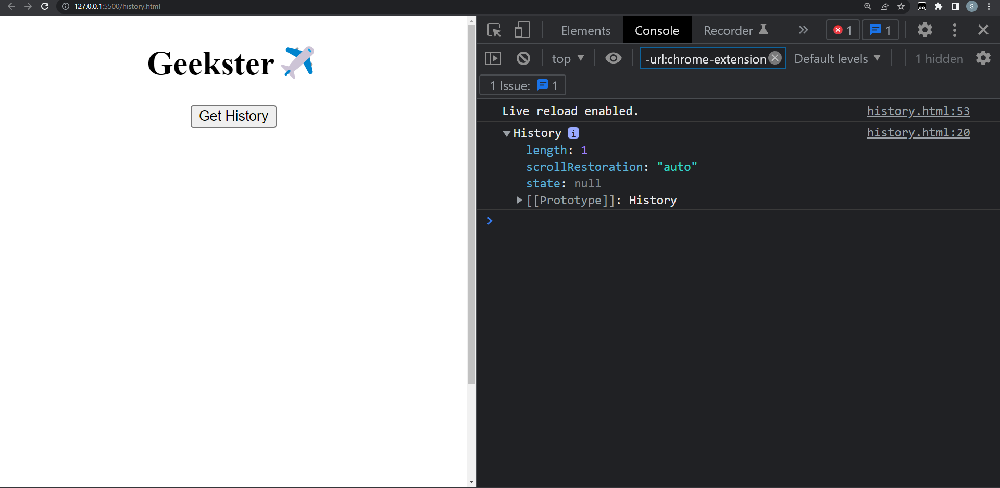
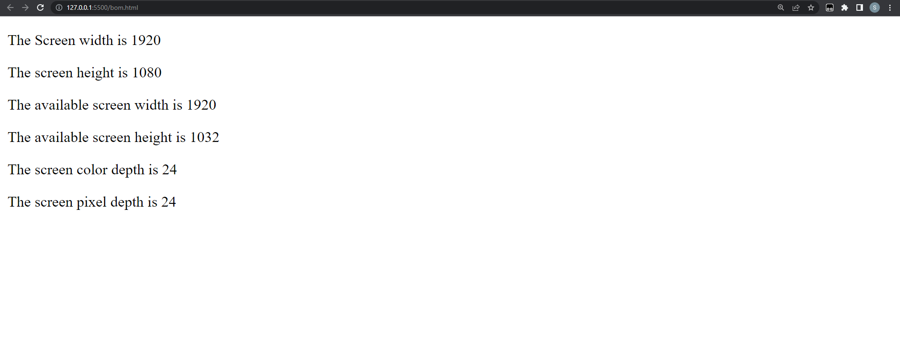

- [Day 11](#day-11)
	- [Browser Object Model](#browser-object-model)
	- [BOM Examples](#the-important-bom-objects-are-as)
	 - [Document](#document)
	 - [Location](#location)
	 - [history](#history)
	 - [Navigator](#navigator)
	 - [screen](#screen)

# Day 11

## Browser Object Model

In order to communicate with the browser, one uses the Browser Object Model (BOM).

Since window is the browser's default object, you can call all of its functions either directly or by supplying window. For example:

```js
window.alert("hello javatpoint"); 
```
is same as:

```js
alert("hello javatpoint");  
```
We can use JavaScript's WebAPIs and Interfaces (object types) for creating online applications or websites. These objects and APIs enable us to manage the lifecycle of a webpage and carry out a number of tasks, such as changing screen size, opening and shutting new browser windows, updating URLs, retrieving cookies, and local storage, among other things.

Browser objects are the interfaces (object types) that enable us to interact with the browser window. The word "browser object" isn't official, but it refers to a collection of objects that are members of multiple WebAPIs and are used to manage a variety of browser-related data and operations.

For instance, when a browser opens an HTML document, the browser interprets it as a collection of hierarchical objects (HTML tags) and displays the data contained in these objects as a result (HTML page rendering). The document is parsed by the browser, which then generates a group of objects that define the content and its specifics. The image below shows the numerous objects that can be used to access different parts of the browser window:


The numerous sorts of browser objects used to interact with the browser are part of multiple APIs. The model of these Browser objects is another name for the collection (BOM).

Since Window is the browser's default object, you can call its functions directly.

<hr>

## The important BOM objects are as:

## **document**

- The HTML file that the browser has loaded is represented by this object. An object called a document object gives users access to all of a document's HTML elements (webpage). We can alter any existing HTML tag, add a new HTML tag to the webpage, etc. with this object.
we have already seen this.

<hr>

## **location** 

- Location is a built-in object which represent the location of the object to which it is linked, which can be Window or Document. Both the Document and Window interface have a linked location property.

- location.href returns the URL of the web page currently loaded in the browser window.

**Syntax**

```
console.log("URL of the web page " + location.href)
```

- location.hostname returns the domain name of the current host (excluding the port number)

**Syntax**

```
console.log("Domain name of current host page is " + location.hostname)
```
- location.protocol returns the web protocol being used by the current web page (http:, file: or https:)

**Syntax**

```
console.log("Protocol used by the current page is " + location.protocol)
```

- location.assign returns a new web page loaded in the window, when the complete address is specified.

**Syntax**

```
location.assign("http://www.google.com")
```

- location.reload reloads the current page. Its function is the same as that of reload button in the browser window.

**Syntax**

```
location.reload();
```

**OUTPUT**


<hr>

## **history** 

- It stores Uniform Resource Locator(URLs) visited by a user in the browser. It is a built-in object which is used to get browser history. This object is a property of the JavaScript Window object.

**SYNTAX**

```js
var e = window.history
```
**EXAMPLE**

```html
<!DOCTYPE html>
<html>
 
<body>
    <center>
        <h1>Geekster✈️</h1>
 
        <button onclick="get()">
            Get History
        </button>
         
        <br><br>
        <div id="g"></div>
         
        <svg viewBox="0 0 1000 1000"
            xmlns="http://www.w3.org/2000/svg">
             
            <script type="text/javascript">
                function get() {
                    console.log(window.history);
                }
            </script>
        </svg>
    </center>
</body>
 
</html>
```

**OUTPUT**



<hr>

## **navigator** 

- It acts as a storehouse of all the data and information about the Browser software used to access the webpage and this object is used to fetch information related to the browser for example, whether the user is using Chrome browser or Safari browser, which version of browser is being used etc.

**SYNTAX**

```js
var nav = window.navigator;
```
1	appName	- returns the name

2	appVersion -	returns the version

3	appCodeName - 	returns the code name

4	cookieEnabled -	returns true if cookie is enabled otherwise false

5	userAgent -	returns the user agent

6	language -	returns the language. It is supported in Netscape and Firefox only.

7	userLanguage -	returns the user language. It is supported in IE only.

8	plugins	returns - the plugins. It is supported in Netscape and Firefox only.

9	systemLanguage - returns the system language. It is supported in IE only.

10	mimeTypes[] - returns the array of mime type. It is supported in Netscape and Firefox only.

11	platform - returns the platform e.g. Win32.

12	online - returns true if browser is online otherwise false.

**EXAMPLE**

```html
<!DOCTYPE html>
<html lang="en">
<head>
    <meta charset="UTF-8">
    <meta http-equiv="X-UA-Compatible" content="IE=edge">
    <meta name="viewport" content="width=device-width, initial-scale=1.0">
    <title>Document</title>
</head>
<body>
    <script>  
        document.writeln("<br/>navigator.appCodeName: "+navigator.appCodeName);  
        document.writeln("<br/>navigator.appName: "+navigator.appName);  
        document.writeln("<br/>navigator.appVersion: "+navigator.appVersion);  
        document.writeln("<br/>navigator.cookieEnabled: "+navigator.cookieEnabled);  
        document.writeln("<br/>navigator.language: "+navigator.language);  
        document.writeln("<br/>navigator.userAgent: "+navigator.userAgent);  
        document.writeln("<br/>navigator.platform: "+navigator.platform);  
        document.writeln("<br/>navigator.onLine: "+navigator.onLine);  
        </script>  
</body>
</html>
```

**OUTPUT**


<hr>

## **screen** 

- It is a built-in object which is used to fetch information related to the browser screen, like the screen size, etc. It is also obtained from the Window object.

Properties:

- screen.width - screen.width property returns the users screen width in pixels. 
- screen.height - screen.height property returns the users screen height in pixels. 
- screen.availWidth - screen.availWidth property returns the users screen width in pixels, excluding the interface features. 
- screen.availHeight - screen.availHeight property returns the users screen height in pixels excluding the interface features. 
- screen.colorDepth - screen.colorDepth property returns the bits (number) to be used to display one color. Usually, 24 bit or 32 bit hardware is used for color resolution. 
- screen.pixelDepth - screen.pixelDepth property returns the pixel depth of the screen. 

**EXAMPLE**

```html
<!DOCTYPE html>
<html>
<body>
<p id="Geeks1"></p>
<p id="Geeks2"></p>
<p id="Geeks3"></p>
<p id="Geeks4"></p>
<p id="Geeks5"></p>
<p id="Geeks6"></p>
<script>
document.getElementById("Geeks1").innerHTML =
" The Screen width is " + screen.width;
document.getElementById("Geeks2").innerHTML =
" The screen height is " + screen.height;
document.getElementById("Geeks3").innerHTML =
"The available screen width is " + screen.availWidth;
document.getElementById("Geeks4").innerHTML =
"The available screen height is " + screen.availHeight;
document.getElementById("Geeks5").innerHTML =
"The screen color depth is " + screen.colorDepth;
document.getElementById("Geeks6").innerHTML =
"The screen pixel depth is " + screen.pixelDepth;
</script>
</body>
</html>
```
**OUTPUT**



<hr>

