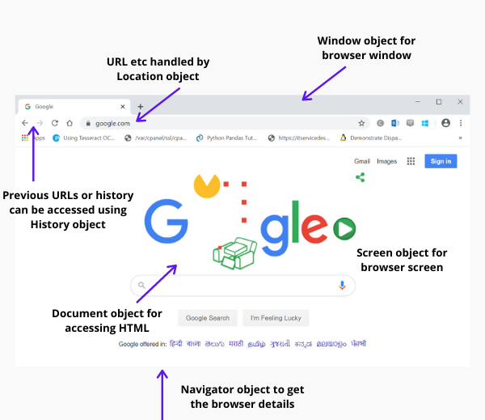

- [Day 11](#day-11)
	- [Browser Object Model](#Browser_Object_Model)
	- [BOM Examples](#BOM_Example)

# Day 11

## Browser Object Model
In order to communicate with the browser, one uses the Browser Object Model (BOM).

Since window is the browser's default object, you can call all of its functions either directly or by supplying window. For example:
```js
window.alert("hello javatpoint"); 
```
is same as:
```js
alert("hello javatpoint");  
```
We can use JavaScript's WebAPIs and Interfaces (object types) for creating online applications or websites. These objects and APIs enable us to manage the lifecycle of a webpage and carry out a number of tasks, such as changing screen size, opening and shutting new browser windows, updating URLs, retrieving cookies, and local storage, among other things.
Browser objects are the interfaces (object types) that enable us to interact with the browser window. The word "browser object" isn't official, but it refers to a collection of objects that are members of multiple WebAPIs and are used to manage a variety of browser-related data and operations.

For instance, when a browser opens an HTML document, the browser interprets it as a collection of hierarchical objects (HTML tags) and displays the data contained in these objects as a result (HTML page rendering). The document is parsed by the browser, which then generates a group of objects that define the content and its specifics. The image below shows the numerous objects that can be used to access different parts of the browser window:



The numerous sorts of browser objects used to interact with the browser are part of multiple APIs. The model of these Browser objects is another name for the collection (BOM).

Since Window is the browser's default object, you can call its functions directly.

## The important BOM objects are as:

**document** - The HTML file that the browser has loaded is represented by this object. An object called a document object gives users access to all of a document's HTML elements (webpage). We can alter any existing HTML tag, add a new HTML tag to the webpage, etc. with this object.

**location** -Location is a built-in object which represent the location of the object to which it is linked, which can be Window or Document. Both the Document and Window interface have a linked location property.

**history** - It stores Uniform Resource Locator(URLs) visited by a user in the browser. It is a built-in object which is used to get browser history. This object is a property of the JavaScript Window object.

**navigator** - It acts as a storehouse of all the data and information about the Browser software used to access the webpage and this object is used to fetch information related to the browser for example, whether the user is using Chrome browser or Safari browser, which version of browser is being used etc.

**screen** - It is a built-in object which is used to fetch information related to the browser screen, like the screen size, etc. It is also obtained from the Window object.

## BOM Example
```html
<!DOCTYPE html>
<html>
<head>
    <title>BOM Examples</title>
    <script>
        var browserInfo = window.navigator.appName + " " + window.navigator.appVersion;
        document.write("<h2>Browser Info</h2><p>"+browserInfo +"</p>");
        var newWindow;
        function opennewWindow() {
            newWindow = window.open("", "", "width=500, height=300, top=150, left=150");
            newWindow.document.title = "New Window";
            paraGraph = document.createElement("P");
            paraGraph_text = document.createTextNode("New Paragraph");
            paraGraph.appendChild(paraGraph_text);
             newWindow.document.body.appendChild(paraGraph);
        }
        function closenewWindow() {
            if (newWindow != undefined) {
                newWindow.close();
                newWindow = undefined;
            }
            else {
                alert("Nothing to open !!");
            }
        }
    </script>
</head>
<body>
    <h2>BOM Window Object</h2>
    <p>
        <input type="button" value="Open Window" onclick="opennewWindow()" />
        <input type="button" value="Close Window" onclick="closenewWindow()" />
    </p>
</body>
</html>
```
