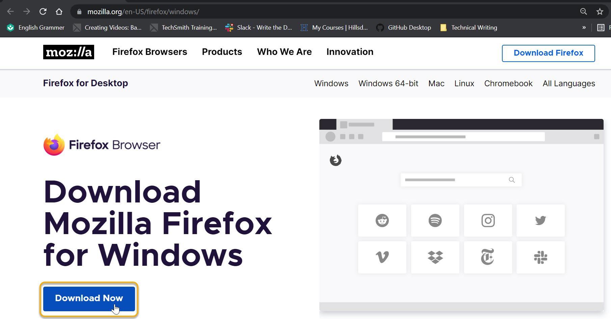
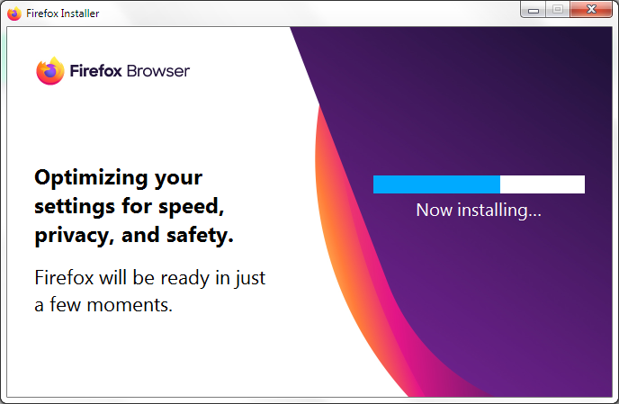
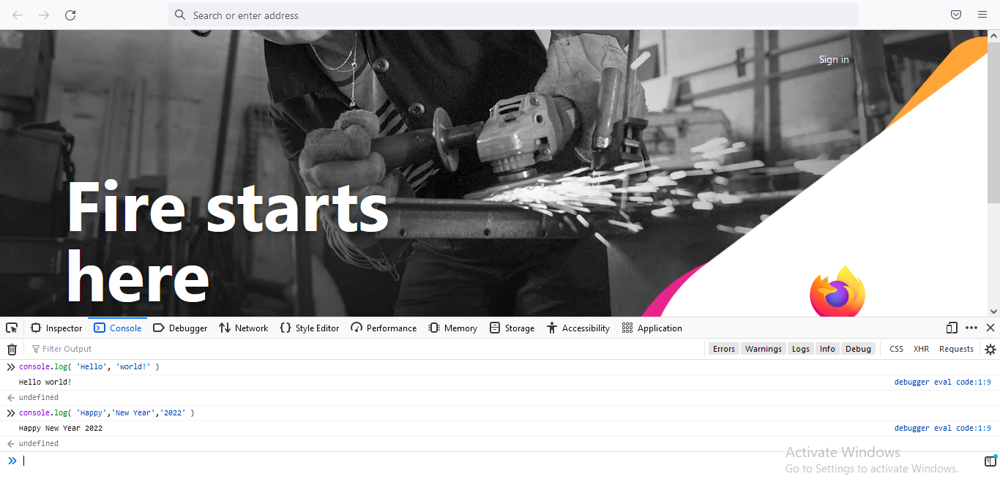

- [JavaScript Introduction](#javascript-introduction)
    - [What is JavaScript](#what-is-javascript)
    - [Why we need JavaScript](#why-we-need-javascript)
    - [What JavaScript in browser can do](#what-javascript-in-browser-can-do)
    - [What JavaScript cannot do in browser](#what-javascript-cannot-do-in-browser)
    - [Why is JavaScript unique from other programming language](#why-is-javascript-unique-from-other-programming-language)
- [Setup](#setup)
	- [Install Node.js](#install-nodejs)
    - [Installing Mozilla FireFox](#installing-mozilla-firefox)
        - [Opening FireFox Console](#opening-FireFox-console)
            - [Console.log](#consolelog)
            - [Console.log with Multiple Arguments](#consolelog-with-multiple-arguments)
            - [Comments](#comments)
            - [Syntax](#syntax)
        - [Arithmetics](#arithmetics)
- [Introduction to Data types](#introduction-to-data-types)
	- [Numbers](#numbers)
	- [Strings](#strings)
	- [Booleans](#booleans)
	- [Undefined](#undefined)
	- [Null](#null)        

- [JavaScript Variables](#javascript-variables)
    - [JavaScript-Declare-Variables](#javascript-declare-variables)
    - [JavaScript Initialize Variables](#javascript-initialize-variables)
    - [Change the Value of Variables](#change-the-value-of-variables)
    - [Rules for Naming JavaScript Variables](#rules-for-naming-javascript-variables)

- [Excercises](#excercises)

# JavaScript Introduction

## What is JavaScript

JavaScript is a scripting or programming language that allows you to implement complex features on web pages.

## Why we need JavaScript

JavaScript makes web pages dynamic. Using JavaScript, it is also possible to load the content in a document without reloading the webpage.

## What JavaScript in browser can do

1. Can change existing HTML with new HTML using DOM(Object in JavaScript)
2. React to user actions/events.
3. Send requests to remote servers, download and upload files(AJAX).
4. Get and set cookies, ask questions to the visitor, show messages.
5. Remember the data on the client-side (“local storage”).

## What JavaScript cannot do in browser

1. JavaScript on a webpage may not read/write arbitrary files on the hard disk, copy them or execute programs. It has no direct access to OS functions.

2. Different tabs generally do not know about each other. Sometimes they do , 
for example when one tab uses JavaScript to open the other one. But even in this case, JavaScript from one page may not access the other if they come from different sites.

This is called the “Same Origin Policy”. To work around that, both pages must agree for data exchange and contain a special JavaScript code that handles it.

## Why is JavaScript unique from other programming language

1. Full integration with HTML/CSS.
2. Simple things are done simply.
3. Supported by all major browsers and enabled by default.


# Setup

I believe you have the motivation and a strong desire to be a developer, a computer and Internet. If you have those, then you have everything to get started.

## Install Node.js

You may not need Node.js right now but you may need it for later. Install [node.js](https://nodejs.org/en/).


After downloading click next, next and install

We can check if node is installed on our local machine by opening our device terminal or command prompt.

```sh
node -v
v14.17.3
```

When making this tutorial I was using Node version v14.17.3, by the time you use this material you may have a higher Node.js version.

## Installing Mozilla FireFox

To install Firefox on your computer:

1. Visit this Firefox download page in any browser, such as Microsoft Edge.
2. Click the Download Now button. The Firefox Installer that downloads will automatically offer you the best available version of Firefox for your computer.



Click Open file in the Downloads notification on Microsoft Edge to start the process.
In other browsers, you may need to first save the Firefox installer to your computer, then open the file you downloaded.
**Note:** If you see an Open File - Security Warning dialog, click **Open** or **Run**.


3. The User Account Control dialog may open, to ask you to allow the Firefox Installer to make changes to your computer. If this dialog appears, click Yes to start the installation.


4. Wait for Firefox to finish installing.



5. When the installation is complete, Firefox will open.


**Congratulations, you are done installing Firefox!**

### Opening FireFox Console

You can open Google Chrome console either by clicking three lines at the top right corner of the browser, selecting _More tools -> web Developer tools_ or using a keyboard shortcut. I prefer using shortcuts.


**ShortCut To open Browser Console**
```
For Windows
Ctrl+Shift+i
```

### Console.log

To write our first JavaScript code, we used a built-in function **console.log()**. We passed an argument as input data, and the function displays the output. We passed `'Hello, World'` as input data or argument in the console.log() function.
```js
console.log('Hello, World!')
```

### Console.log with Multiple Arguments

The **`console.log()`** function can take multiple parameters separated by commas. The syntax looks like as follows:**`console.log(param1, param2, param3)`**



```js
console.log('Hello', 'World', '!')
console.log('HAPPY', 'NEW', 'YEAR', 2020)
```

As you can see from the snippet code above, _`console.log()`_ can take multiple arguments.

Congratulations! You wrote your first JavaScript code using _`console.log()`_.


### Comments

We can add comments to our code. Comments are very important to make code more readable and to leave remarks in our code. JavaScript does not execute the comment part of our code. In JavaScript, any text line starting with // in JavaScript is a comment, and anything enclosed like this `//` is also a comment.

**Example: Single Line Comment**

```js
// This is the first comment  
// This is the second comment  
// I am a single line comment
```

**Example: Multiline Comment**

```js
/*
This is a multiline comment  
 Multiline comments can take multiple lines  
 JavaScript is the language of the web  
 */
```

### Arithmetics

Now, let us practice more writing JavaScript codes using _`console.log()`_ on Google Chrome console for number data types.
In addition to the text, we can also do mathematical calculations using JavaScript. Let us do the following simple calculations.
It is possible to write JavaScript code on Google Chrome console can directly without the **_`console.log()`_** function. However, it is included in this introduction because most of this challenge would be taking place in a text editor where the usage of the function would be mandatory. You can play around directly with instructions on the console.


```js
console.log(2 + 3) // Addition
console.log(3 - 2) // Subtraction
console.log(2 * 3) // Multiplication
console.log(3 / 2) // Division
console.log(3 % 2) // Modulus - finding remainder
console.log(3 ** 2) // Exponentiation 3 ** 2 == 3 * 3
```

# Introduction to Data types

In JavaScript and also other programming languages, there are different types of data types. The following are JavaScript primitive data types: _String, Number, Boolean, undefined, Null_, and _Symbol_.

## Numbers

- Integers: Integer (negative, zero and positive) numbers
  Example:
  ... -3, -2, -1, 0, 1, 2, 3 ...
- Float-point numbers: Decimal number
  Example
  ... -3.5, -2.25, -1.0, 0.0, 1.1, 2.2, 3.5 ...

## Strings

A collection of one or more characters between two single quotes, double quotes, or backticks.

**Example:**

```js
'a'
`We can also create a string using a backtick`
'A string could be just as small as one character or as big as many pages'
'Any data type under a single quote, double quote or backtick is a string'
```

## Booleans

A boolean value is either True or False. Any comparisons returns a boolean value, which is either true or false.

A boolean data type is either a true or false value.

**Example:**

```js
true // if the light is on, the value is true
false // if the light is off, the value is false
```

## Undefined

In JavaScript, if we don't assign a value to a variable, the value is undefined. In addition to that, if a function is not returning anything, it returns undefined.

```js
let firstName
console.log(firstName) // undefined, because it is not assigned to a value yet
```

## Null

Null in JavaScript means an empty value.

```js
let emptyValue = null
```

# JavaScript Variables

In programming, a variable is used to store data.

**Example:**

```js
let x = 5;
```
Here, x is a variable. It's storing 10.

## JavaScript Declare Variables

In JavaScript, we use either var or let keyword to declare variables.
**Example:**

```js
var i;
let j;
```
Here i and j are variables.

## JavaScript Initialize Variables

the assignment operator ```=``` to assign a value to a variable.

```
let x;
x=10;
```
Here, 10 is assigned to variable x.

You can also initialize variables during its declaration.
```
let x=10;
```
In JavaScript, it's possible to declare variables in a single statement.
``` let x = 5, y = 6, z = 7; ```

If you use a variable without initializing it, it will have an undefined value.

```
let x;
console.log(x); // undefined
```

In javaScript undefined is a special keyword. we will learn about it in later tutorials.

## Change the Value of Variables

It's possible to change the value stored in the variable.

**Example**

```
// 5 is assigned to variable x
let x = 5; 
console.log(x); // 5

// value of variable x is changed
x = 3; 
console.log(x); // 3
```

## Rules for Naming JavaScript Variables

1. Variable names must start with either a letter, an underscore _, or the dollar sign $.

**Example**
```
//valid
let a = 5;
let _a = 5;
let $a = 5;
```

2. Variable names cannot start with numbers.

**Example**
```
//invalid
let 1a=5;
```

3. JavaScript is case-sensitive. So x and X are different variables.

**Example**
```
let x = "Hello";
let X = 5;

console.log(x); // Hello
console.log(X); // 5
```

4. Keywords cannot be used as variable names. 

**Example**

```
//invalid
let new = 5; // Error! new is a keyword.
```
**Note**
In JavaScript, the variable names are generally written in camelCase if it has multiple words. For example, firstName, annualSalary, etc.

# Excercises

1. [Comment Your JavaScript Code](https://www.freecodecamp.org/learn/javascript-algorithms-and-data-structures/basic-javascript/comment-your-javascript-code)

2. [Declare JavaScript Variables](https://www.freecodecamp.org/learn/javascript-algorithms-and-data-structures/basic-javascript/declare-javascript-variables)

3. [Storing Values with the Assignment Operator](https://www.freecodecamp.org/learn/javascript-algorithms-and-data-structures/basic-javascript/storing-values-with-the-assignment-operator)

4. [Assigning the Value of One Variable to Another](https://www.freecodecamp.org/learn/javascript-algorithms-and-data-structures/basic-javascript/assigning-the-value-of-one-variable-to-another)

5. [Initializing Variables with the Assignment Operator](https://www.freecodecamp.org/learn/javascript-algorithms-and-data-structures/basic-javascript/initializing-variables-with-the-assignment-operator)

6. [Understanding Case Sensitivity in Variables](https://www.freecodecamp.org/learn/javascript-algorithms-and-data-structures/basic-javascript/understanding-case-sensitivity-in-variables)

